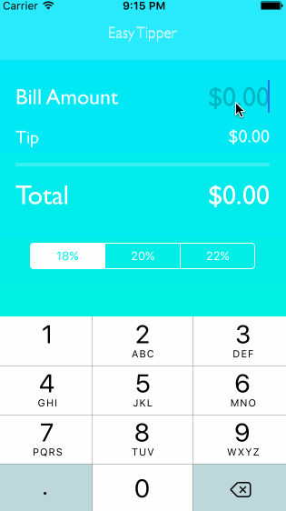

# Simple Tip Calculator

This is an iOS demo application for basic tip calculator functionality.
Time spent: 4 hours spent in total

Completed user stories:

 * [x] Required: User can input a total bill amount
 * [x] Required: User can select between different tipping percentages
 * [x] Required: User can click out of editing
 * [x] Optional: Add a gradient to the background
 * [x] Optional: Added a custom font
 * [x] Optional: App icon
  
 
Notes:
Spent some time making the background gradient styling into it's own class so that it be applied mutiple screens without

Walkthrough of all user stories:

GIF created with [LiceCap](http://www.cockos.com/licecap/).
